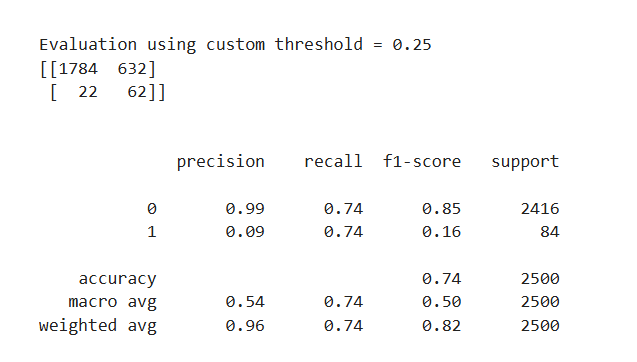
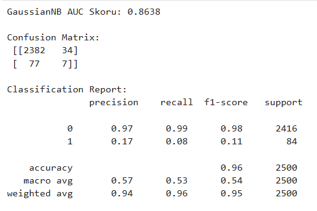
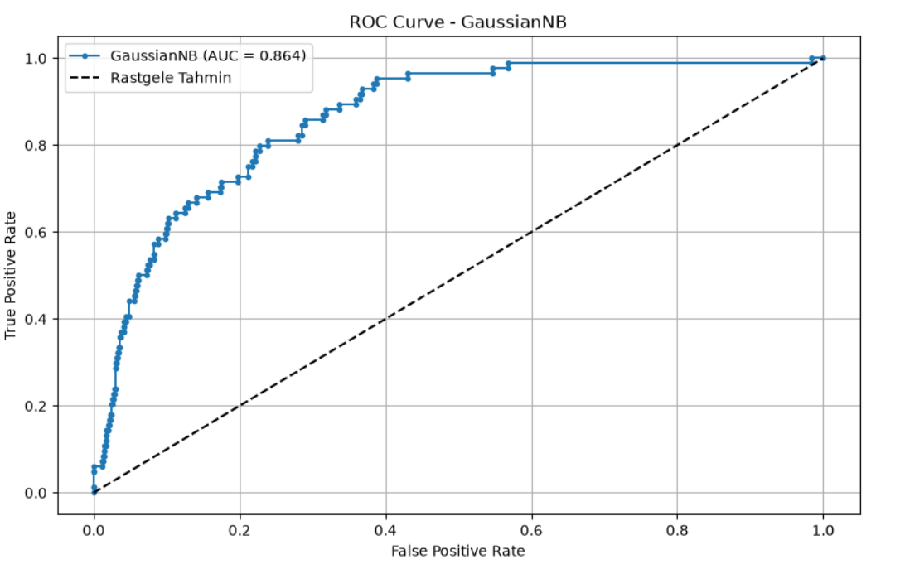

# 🤖 Machine Learning Model Evaluation & Classification Performance

Bu depoda, farklı makine öğrenmesi algoritmalarının (`Support Vector Classifier`, `Logistic Regression` ve `Gaussian Naive Bayes`) sınıflandırma performansları detaylı bir şekilde test edilmiş; confusion matrix, classification report ve ROC-AUC eğrileri üzerinden karşılaştırmalı analizleri yapılmıştır.

## 🛠️ Kullanılan Teknolojiler

* **Python 3**
* **Scikit-Learn** (Modelleme ve Metrik Hesaplama)
* **Matplotlib & Seaborn** (Görselleştirme)

---

## 📊 Model Performansları ve Karşılaştırmalı Analiz

### 1. Support Vector Classifier (SVC - RBF Kernel)
SVC modeli, dengesiz veri setlerinde ve karmaşık karar sınırlarında yüksek performans göstermiştir. Özel eşik değeri (`threshold = 0.25`) ile yapılan değerlendirmede model, dengeli bir precision ve recall dengesi yakalamıştır.

* **Confusion Matrix ve Classification Report:**
  

**ROC Eğrisi ve AUC Skoru:** Model **0.9217** gibi oldukça yüksek bir AUC skoru elde ederek sınıflandırma yeteneğinin ne kadar güçlü olduğunu kanıtlamıştır.

### 2. Logistic Regression
Doğrusal sınıflandırma problemlerinin vazgeçilmezi olan Lojistik Regresyon modeli, özel eşik optimizasyonuyla birlikte test edilmiştir.

* **Confusion Matrix ve Classification Report:**

* * **ROC Eğrisi ve AUC Skoru:** Model **0.8265** AUC skoru ile genel eğri altında başarılı bir performans sergilemiştir.

### 3. Gaussian Naive Bayes (GaussianNB)
Olasılıksal temelli yaklaşımıyla bilinen GaussianNB modeli, hızlı sonuçlar üretebilmesine rağmen azınlık sınıfındaki (`1` sınıfı) yakalama oranında (recall) diğer modellere nazaran daha düşük kalmıştır.

* **Confusion Matrix ve Classification Report:**

* **ROC Eğrisi ve AUC Skoru:** Model **0.8638** AUC skoruna ulaşmıştır.

---
📂 Proje Yapısı

* `ai4i2020`: Analizde kullanılan ham veri seti.

* `README`: Projenin genel özeti ve performans raporu.
